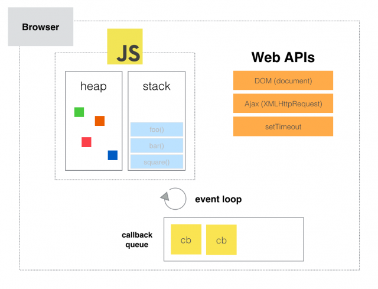

# JS-refcards

### `let` and `const` VS `var`
New `let` and `const` defined in ES6 are block scoped while `var` is function scoped.
```javascript
{
  var a = 'a';
  let b = 'b'; // is not defined outside
  const c = 'c'; // is not defined outside
}
console.log(a);
```

### IIFE (Immediately Invoked Function Expression)
A way to immediately invoke a function expression, utilizing the function's execution context to create "privacy".
```javascript
(function() { 
  var a = 'a'; 
})();

console.log(a); // 'a' is undefined here
```
### Function declaration VS function expression
//TODO

### Execution context
//TODO

### Event loop
A JS runtime uses a message queue, which is a list of messages to be processed. Each message has an associated function which gets called in order to handle the message.\
Example with `setTimeout()`:
```javascript
const second = () => {
  setTimeout(() => {
    console.log('Async hi there!')
  }, 2000);
};
const first = () => {
  console.log('Hi there!');
  second();
  console.log('End');
}
first();
```
1. JS script submits a `setTimeout` (which is a part of Web API, and lives outside of JS engine).
It has an attached callback.
2. When timer is off, a message with the callback is put into a message queue
3. When execution stack gets empty, event loop polls message queue, finds a message there and puts an attached function into execution stack.
This is how DOM events also get processed.
4. Supplied callback function gets executed


### Arrow functions VS functions
Methods are functions attached to an object. They can refer to the object via `this`.
Instead regular functions have `this` pointing to the global object (e.g. "Window" object).

Arrow functions do not have their own `this`. 
Instead they share a surrounding's `this`.

This is useful when it is necessary to preserve the value of `this`.

:exclamation: Arrow functions can not be constructors, i.e. `new (() => {})` is not acceptable.

```javascript
// ES5
var box5 = {
    position: 1,
    clickMe: function() {
       var self = this; 
       document.querySelector('.green').addEventListener('click', function() {
            // can not refer to box5.position as `this.position` here:
            alert('This is box number ' + self.position);
        });
    }
}

// ES6
const box6 = {
    position: 1,
    clickMe: () => {
        document.querySelector('.green').addEventListener('click', () => {
            alert('This is box number ' + this.position);
        });
    }
}
```

### Using constructors and classes to create objects in JS
Function constructor way:
```javascript
// mind the capital letter
var Person = function(firtstName, lastName, yearOfBirth) {
  this.firstName = firtstName;
  this.lastName = lastName;
  this.yearOfBirth = yearOfBirth;
}

// adding a method via prototype
Person.prototype.calculateAge = function() {
  return new Date().getFullYear() - yearOfBirth;
}

const john = new Person(...);
```

ES6 classes way:
```javascript
// each class has to declare a constructor
class Person {
  constructor(firtstName, lastName, yearOfBirth) {
    this.firstName = firtstName;
    this.lastName = lastName;
    this.yearOfBirth = yearOfBirth;
  }
  
  // mind no commas or semicolons inside class declaration
  
  calculateAge() {
    return new Date().getFullYear() - this.yearOfBirth;
  }
  
  // statics are attached to a class not an object instance
  static staticMethod() {...}
}

const john = new Person(...);

// calling a static
Person.staticMethod();
```
:exclamation: classes are not hoisted unlike variables\
:exclamation: only methods can be declared inside a class but not properties

### Inheritance
ES5 way, usage of prototypes
//TODO
ES6 way, usage of `extends` and `super`:
```javascript
class Athlete extends Person {
  constructor(firtstName, lastName, yearOfBirth, medals) {
    super(firtstName, lastName, yearOfBirth);
    this.medals = medals;
  }
}
```

### String tempaltes in ES6
```javascript
var a = 5;
var b = 10;
console.log(`Fifteen is ${a + b} and not ${2 * a + b}.`);
```

### The `arguments` object
`Arguments` is an Array-like object accessible inside functions that contains the values of the arguments passed to that function.
Rest parameters in ES6 should be preferred.
```javascript
function func1(a, b, c) {
  console.log(arguments[0]);
}
```

### Rest parameters in ES6
The rest parameter syntax allows us to represent an indefinite number of arguments as an array.
```javascript
function sum(...theArgs) {
  return theArgs.reduce((previous, current) => {
    return previous + current;
  });
}
```
Unlike spread operator rest parameters are used in function's declaration.

### Spread syntax
In ES6 spread operator expands an iterable into it's components
```javascript
function sum(x, y, z) {
  return x + y + z;
}

const numbers = [1, 2, 3];

console.log(sum(...numbers));
```

Useful to copy or concatenate arrays:
```javascript
//Copy an array
var arr = [1, 2, 3];
var arr2 = [...arr]; // like arr.slice()

// Concatenate
var arr1 = [0, 1, 2];
var arr2 = [3, 4, 5];
arr1 = [...arr1, ...arr2];
```

### Default function parameters
Default function parameters allow named parameters to be initialized with default values if no value or undefined is passed.
```javascript
function multiply(a, b = 1) {
  return a * b;
}
```
Can be useful for constructors:
```javascript
function Person(firstName, lastName = 'Smith') {...}
```

### JS maps
The Map object holds key-value pairs. Unlike object map:
- keeps order
- anything can be as either a key or a value (even in the same map instance)
```javascript
var myMap = new Map();

var keyString = 'a string',
    keyObj = {},
    keyFunc = function() {};

// setting the values
myMap.set(keyString, "value associated with 'a string'");
myMap.set(keyObj, 'value associated with keyObj');
myMap.set(keyFunc, 'value associated with keyFunc');
```
- has `size` property
- is iterable
```javascript
// iterate with for of
for (var [key, value] of myMap) {
  console.log(key + ' = ' + value);
}

// iterate with forEach
map.forEach((key,value) => {...})
```
### for...of statement
The for...of statement creates a loop iterating over iterable objects, including: built-in `String`, `Array`, Array-like objects (e.g., `arguments` or `NodeList`), `Map` other iterables.
```javascirpt
let iterable = [10, 20, 30];

for (let value of iterable) {
  value += 1;
  console.log(value);
}
```

### Usage of `typeof`
```javascript
// Numbers
typeof 37 === 'number';
typeof Number('1') === 'number'; // Number tries to parse things into numbers

// But ind the following
typeof new Number(1) === 'object';

// Strings
typeof '' === 'string';

// Booleans
typeof true === 'boolean';

// Undefined
typeof undefined === 'undefined';

// Objects
typeof {a: 1} === 'object';

// use Array.isArray to differentiate regular objects from arrays
typeof [1, 2, 4] === 'object';

// Functions
typeof function() {} === 'function';
```

### Callback hell
Many nested callbacks can produce "callback hell" and make code unmanagable
http://callbackhell.com/


### Promises
Promise is a container for a future value of an async operation.

Promises let async methods return values like sync methods: instead of immediately returning the final value, an async method returns a promise to supply a value at some point in the future.

A Promise is in one of these states:
- pending: initial state, neither fulfilled nor rejected.
- fulfilled: meaning that the operation completed successfully.
- rejected: meaning that the operation failed.

\
A promise is said to be `settled` or `resolved` if it is either `fulfilled` or `rejected`, but not `pending`.

As the `Promise.prototype.then()` and `Promise.prototype.catch()` methods return promises, they can be chained.

```javascript
// The only argument of Promise constructor is "executor function"
// It's arguments are "resolve" and "reject" which are callback functions 
// We call resolve() if what we were doing asynchronously was successful, and reject() if not.
const getIDs = new Promise((resolve, reject) => {
	// Here some async task is put 
	setTimeout(() => {
		//...doing something...
		// Resolve() takes an argument which is the final result of the promise
		resolve([111,112]);				
		// Here we do not need reject(), since setTimeout never fails
		//reject('error happened');
	}, 1500);
});

// Consuming the promise
// then() allows to add an event handler for the case when a promise is fullfilled 
getIDs.then(IDs => {
	//IDs.foreach()
	console.log(IDs);
}).catch(error => {
	console.log(error);
});
```

Promises consuming can be chained like 
```javascript
somePromise
	.then(result => {
		return somePromise2;
	})
	.then(result => {
		return somePromise3;
	})
	.catch(error => {...});
```
